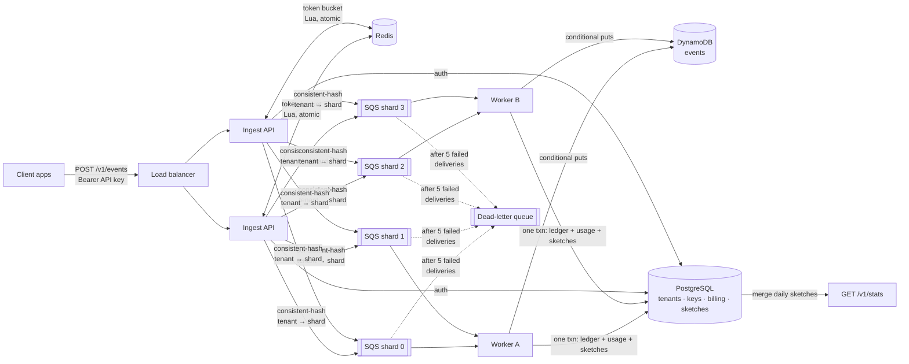

# Tally

[](https://github.com/saratheiranian/tally/actions/workflows/ci.yml)

**A multi-tenant, real-time event analytics platform.** Apps send events (`page_view`, `signup`, `purchase`); Tally ingests them at high volume, stores them durably, and serves live aggregates: event counts, unique users, and top events and pages over any date range.

Built to explore distributed-systems problems end to end: idempotent ingestion, distributed rate limiting, back-pressure, SQL + NoSQL data modelling, and probabilistic algorithms, deployed on AWS.

## Results at a glance

| Claim | Evidence |
|---|---|
| **No event lost or double-counted under failure** | [Chaos test](chaos/RESULTS.md): 9 worker SIGKILLs, an API kill, and a Postgres outage mid-stream, plus 2,500 duplicate events from client retries. Billing, storage, and sketches all equal ground truth exactly (12,000 / 12,000). Runs nightly in CI. |
| **Sketches match exact answers** | Unique users within **0.41%** of exact; top-10 pages identical, in order. Measured error matches theory across 20 trials ([benchmarks](packages/sketches/benchmarks/RESULTS.md)). |
| **Sketch queries are fast** | **9 ms** vs 1,455 ms for the exact scan on 5k events; cost grows with days, not events |
| **Ingest throughput** | ~2,000 events/s cleanly, ~4,000 at the edge, **0 errors across 270k events**, on a *single shared vCPU* ([load test](loadtest/README.md)) |
| **Production-ready AWS** | 79 Terraform resources; tflint clean; **Checkov 217 passed / 0 failed** (21 documented trade-offs) ([infra](infra/README.md)) |
| **Correctness is tested, and the tests are tested** | 47 backend + 23 package tests against real Postgres and Redis. Concurrency tests are mutation-tested: they fail if either locking step is removed. |

**What it covers:** distributed multi-tier systems (sharded queues, consistent hashing, exactly-once effects over at-least-once delivery) · algorithms (HyperLogLog, Count-Min Sketch, heavy hitters, token bucket, k-way merge) · relational databases (normalized schema, set-based SQL, ledger idempotency, row locking) · NoSQL (DynamoDB key design, write sharding, conditional writes) · AWS (ECS Fargate, RDS, ElastiCache, SQS, DynamoDB, IAM, CloudWatch, all in Terraform) · open source ([`tally-sketches`](packages/sketches), a standalone, publishable package) · Git (conventional commits, clean, bisectable history) · AI-assisted development ([log and practices](docs/DEVELOPMENT.md)).

## Architecture



**Request path.** The API authenticates, rate-limits, and enqueues on the tenant's shard queue, then returns `202` immediately. Workers write events to DynamoDB, then commit billing *and* sketch updates in one Postgres transaction. They delete messages only after that commits.

**Query path.** `/v1/stats` merges per-day HyperLogLog and TopK sketches, so it costs O(days), not O(events).

## Quickstart

```bash
make up                      # Postgres, Redis, LocalStack (SQS + DynamoDB), API on :8000, 2 workers
make tenant NAME=Acme        # prints an API key (shown once)
make demo KEY=tk_live_...    # sends sample events, handles 429s
make logs                    # watch workers pick up and bill each batch
make stats KEY=tk_live_...   # sketch answer vs exact answer, side by side
open http://localhost:8000/dashboard   # stats page: see the estimate checked against the exact count
make chaos                   # break things mid-stream, then verify every count (needs local Postgres + Redis)
curl localhost:8000/readyz   # {"postgres":"ok","redis":"ok","sqs":"ok"}
```

Interactive API docs are at http://localhost:8000/docs.

### Sending events

```bash
curl -X POST localhost:8000/v1/events \
  -H "Authorization: Bearer $KEY" -H "Content-Type: application/json" \
  -d '{"events":[{"event_id":"7b0c...uuid","name":"signup","distinct_id":"user_42",
                  "properties":{"plan":"pro"},"occurred_at":"2026-09-28T10:00:00Z"}]}'
# 202 {"accepted":1,"duplicates":null}   (queued; dedupe happens in the worker)
```

| Status | Meaning |
|---|---|
| `202` | Durably queued. (In `TALLY_SINK=postgres` mode, stored synchronously and `duplicates` is reported.) |
| `401` | Missing, invalid, or revoked key. |
| `413` | Batch larger than `max_batch_size` or larger than your burst limit. Split it. |
| `422` | Validation error. |
| `429` | Rate limited. Honour `Retry-After`, then resend the **same** batch. |
| `503` | Queue unavailable. Resend the same batch; it's deduplicated downstream. |

### Dashboard

`/dashboard` is a small stats page with no dependencies. It shows unique users on a scale with the estimate's 95% range. **Check against exact count** then drops the true value onto the same scale and states whether the estimate landed inside its range. The page is the product's idea in one screen: fast answers, with honest error bars, that you can verify.

### Querying stats

```bash
curl "localhost:8000/v1/stats?start=2026-09-01&end=2026-09-28&limit=5" -H "Authorization: Bearer $KEY"
```
```json
{"approximate": true, "events": 5000, "unique_users": 201,
 "top_events": [{"key": "page_view", "count": 3971}, ...],
 "top_pages":  [{"key": "/", "count": 688}, ...]}
```

Add `&exact=true` to compute the same answer by scanning DynamoDB, which is slower but lets you verify the sketches. From a local run on 5,000 events:

| | Sketches | Exact scan |
|---|---|---|
| Events | 5,000 | 5,000 |
| Unique users | 201 | 200 |
| Top events / pages | identical | identical |
| Latency | 9 ms | 1,455 ms |

Ranges can span up to 366 days from sketches, or 31 days for exact scans. In `TALLY_SINK=postgres` mode, stats come from plain SQL aggregates.

## Design decisions

**Exactly-once billing on an at-least-once queue** ([ADR 2](docs/decisions/0002-exactly-once-billing-over-at-least-once-delivery.md)). SQS can redeliver, and workers can crash mid-message. Each message carries a stable `batch_id`. Event writes are conditional puts (`attribute_not_exists(pk) OR batch_id = :this_batch`), so a redelivery re-claims its own events while a client's retry in a new batch is rejected as a duplicate. Billing goes through a ledger keyed on `batch_id`. A test kills the worker between the DynamoDB write and the billing write, and checks that the bill still comes out exact.

**Sketches share the billing transaction** ([ADR 4](docs/decisions/0004-sketches-in-the-billing-transaction.md)). Count-Min is additive, so a redelivered message must never be absorbed twice. Sketch updates happen in the same transaction as the billing ledger, under placeholder rows plus ordered `FOR UPDATE` locks. Mutation testing showed each of the two is necessary: removing either one loses 45–90% of updates under a concurrent race.

**Probabilistic algorithms, built from scratch** ([`tally-sketches`](packages/sketches)). HyperLogLog (±0.8% in 16 KiB, versus 85 MB for an exact set of 1M users), Count-Min Sketch with conservative update, and TopK heavy hitters. All are mergeable, serializable, and [benchmarked against exact answers](packages/sketches/benchmarks/RESULTS.md). Unique users across a date range come from a HyperLogLog *union*, not a sum of daily counts, which would double-count returning users.

**Tenant affinity with consistent hashing** ([ADR 3](docs/decisions/0003-tenant-affinity-via-consistent-hashing.md)). Events go to one of N shard queues via a hash ring with virtual nodes, so each tenant always reaches the same worker (needed for Phase 3's in-memory sketches). Adding a shard moves ~1/N of tenants, not ~all of them; tests verify both the movement and the load balance.

**DynamoDB key design.** `pk = tenant#day#shard`, `sk = occurred_at#event_id`. The shard suffix (from `hash(event_id)`) spreads a big tenant's day across 8 partitions instead of one hot one. Reads scatter to all shards in parallel and k-way merge the sorted results.

**Dead-letter queue.** After 5 failed deliveries SQS moves a message to the DLQ, so one poison message can't stall a shard. A test sends a malformed message ahead of a valid one and checks the valid one still gets billed.

**Graceful shutdown.** Workers stop polling on SIGTERM (ECS deploys and scale-in), finish in-flight messages, then exit.

**Idempotency via client-generated IDs.** Every event carries an `event_id` (UUID). `(tenant_id, event_id)` is the primary key, and inserts use `ON CONFLICT DO NOTHING`, so network retries can never double-count. The whole batch, dedupe included, is one set-based `INSERT ... SELECT FROM unnest(...)` round trip.

**Billing in the same statement.** A second data-modifying CTE upserts `usage_daily` using the count of rows *actually inserted*, so duplicates are never billed and usage cannot drift from stored events. It uses the server's day, so clients cannot shift usage by backdating `occurred_at`.

**Distributed rate limiting.** A token bucket per tenant lives in Redis and is updated by a Lua script. Scripts run atomically, so N API nodes cannot jointly over-admit. `test_atomic_under_concurrency` fires 200 simultaneous requests at a burst of 20 and asserts that exactly 20 pass. The script reads `redis.call('TIME')` so all nodes share one clock. Cost equals the batch size, so batching does not bypass limits.

**API keys.** Only a SHA-256 hash is stored. SHA-256 rather than bcrypt is deliberate: keys are 192-bit random strings, not guessable passwords, and auth sits on the hot path. Lookups are cached in-process for 30 s, including misses, which trades up to 30 s of revocation lag for removing a DB round trip per request.

**Why Postgres *and* DynamoDB.** Tenants, users, keys, and billing are relational: foreign keys, constraints, and joins. Raw events are append-heavy, keyed access at a volume where DynamoDB's horizontal scaling and on-demand pricing fit better. See [`docs/decisions`](docs/decisions).

**Liveness vs readiness.** `/healthz` never touches dependencies, so a DB blip does not get containers killed. `/readyz` checks Postgres and Redis, so the load balancer stops routing to a node that cannot serve.

## Testing

Tests run against **real Postgres and Redis** (locally and as CI service containers) and **moto**, an in-process emulator of the real SQS and DynamoDB APIs. Mocking the database layer would hide exactly the behaviours that matter here: constraint semantics, `ON CONFLICT`, Lua atomicity, conditional writes, and redrive.

```bash
make up testdb && make test     # 47 backend + 23 package tests
make chaos                       # fault injection with exact verification
```

The stats tests check sketch answers against exact ones, cross-day unions, and a 20-way concurrent race on one sketch row (mutation-tested: it fails if either locking step is removed). The pipeline tests cover: shard routing, end-to-end storage and billing, redelivery, a crash between the DynamoDB write and billing, client retries across batches, duplicates within a batch, poison messages reaching the DLQ without blocking the shard, splitting a large request across messages, and time-ordered scatter-gather reads.

## Roadmap

- [x] **Phase 1: Ingest + relational core.** Schema, API-key auth, distributed rate limiter, idempotent writes, billing usage, Docker, CI.
- [x] **Phase 2: Async pipeline.** Sharded SQS with consistent-hash routing, DLQ + redrive, DynamoDB event store with write sharding, exactly-once billing, graceful worker shutdown.
- [x] **Phase 3: Algorithms.** HyperLogLog, Count-Min Sketch, and TopK in the standalone [`tally-sketches`](packages/sketches) package (tests, benchmarks, CI across Python 3.10–3.13, release workflow). Integrated with exactly-once updates, plus `/v1/stats` with sketch and exact modes.
- [x] **Phase 4: AWS.** [Terraform](infra/README.md) for the VPC, ECS Fargate, RDS, ElastiCache, SQS, DynamoDB, and ECR, with least-privilege IAM per worker group, backlog-age autoscaling, 7 alarm types, a 10-widget dashboard, migrations as an init container ([ADR 5](docs/decisions/0005-migrations-as-init-container.md)), and CI that lints, security-scans, plans, and deploys.
- [x] **Phase 5: Proof.** [k6 load tests](loadtest/README.md) (open model, step test to saturation), a [chaos test](chaos/RESULTS.md) run nightly in CI, and the stats dashboard.

**Next:** run the load test against AWS and publish those numbers alongside the sandbox baseline; add HyperLogLog++ bias correction to `tally-sketches`; add a Redis AUTH token.

## Repo layout

```
db/migrations/        SQL migrations (applied in order)
packages/sketches/    tally-sketches: standalone, zero-dependency, publishable to PyPI
infra/terraform/      AWS: network, ECS Fargate, RDS, ElastiCache, SQS, DynamoDB, IAM, alarms, dashboard
loadtest/             k6 open-model load test and published results
chaos/                Fault-injection test with exact verification (runs nightly in CI)
services/backend/     One codebase, two entrypoints: API (uvicorn app.main:app) and worker (python -m app.worker)
scripts/              Demo / load helpers
docs/decisions/       Architecture decision records
docs/DEVELOPMENT.md   Workflow, conventions, AI-assisted development log
```
