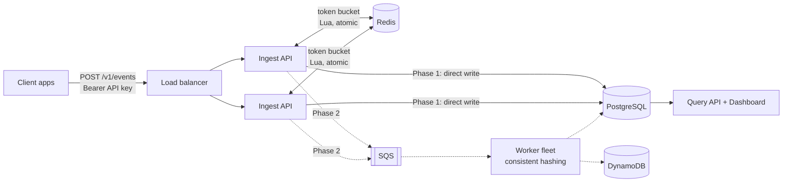

# Tally

**A multi-tenant, real-time event analytics platform.** Apps send events (`page_view`, `signup`, `purchase`); Tally ingests them at high volume, stores them durably, and serves live aggregates: counts, unique users, top pages, funnels.

Built to explore distributed-systems problems end to end: idempotent ingestion, distributed rate limiting, back-pressure, SQL + NoSQL data modelling, and probabilistic algorithms, deployed on AWS.

> **Status:** Phase 1 complete (ingest tier + relational core). See [Roadmap](#roadmap).

## Architecture



Solid lines are built; dotted lines are next.

## Quickstart

```bash
make up                      # Postgres, Redis, ingest API on :8000
make tenant NAME=Acme        # prints an API key (shown once)
make demo KEY=tk_live_...    # sends sample events, handles 429s
curl localhost:8000/readyz   # {"postgres":"ok","redis":"ok"}
```

Interactive API docs are at http://localhost:8000/docs.

### Sending events

```bash
curl -X POST localhost:8000/v1/events \
  -H "Authorization: Bearer $KEY" -H "Content-Type: application/json" \
  -d '{"events":[{"event_id":"7b0c...uuid","name":"signup","distinct_id":"user_42",
                  "properties":{"plan":"pro"},"occurred_at":"2026-09-28T10:00:00Z"}]}'
# 202 {"accepted":1,"duplicates":0}
```

| Status | Meaning |
|---|---|
| `202` | Stored. `duplicates` counts events already seen (safe retries). |
| `401` | Missing, invalid, or revoked key. |
| `413` | Batch larger than `max_batch_size` or larger than your burst limit. Split it. |
| `422` | Validation error. |
| `429` | Rate limited. Honour `Retry-After`, then resend the **same** batch. |

## Design decisions

**Idempotency via client-generated IDs.** Every event carries an `event_id` (UUID). `(tenant_id, event_id)` is the primary key, and inserts use `ON CONFLICT DO NOTHING`, so network retries can never double-count. The whole batch, dedupe included, is one set-based `INSERT ... SELECT FROM unnest(...)` round trip.

**Billing in the same statement.** A second data-modifying CTE upserts `usage_daily` using the count of rows *actually inserted*, so duplicates are never billed and usage cannot drift from stored events. It uses the server's day, so clients cannot shift usage by backdating `occurred_at`.

**Distributed rate limiting.** A token bucket per tenant lives in Redis and is updated by a Lua script. Scripts run atomically, so N API nodes cannot jointly over-admit. `test_atomic_under_concurrency` fires 200 simultaneous requests at a burst of 20 and asserts that exactly 20 pass. The script reads `redis.call('TIME')` so all nodes share one clock. Cost equals the batch size, so batching does not bypass limits.

**API keys.** Only a SHA-256 hash is stored. SHA-256 rather than bcrypt is deliberate: keys are 192-bit random strings, not guessable passwords, and auth sits on the hot path. Lookups are cached in-process for 30 s, including misses, which trades up to 30 s of revocation lag for removing a DB round trip per request.

**Why Postgres *and* DynamoDB (Phase 2).** Tenants, users, keys, and billing are relational: foreign keys, constraints, and joins. Raw events are append-heavy, keyed access at a volume where DynamoDB's horizontal scaling and on-demand pricing fit better. See [`docs/decisions`](docs/decisions).

**Liveness vs readiness.** `/healthz` never touches dependencies, so a DB blip does not get containers killed. `/readyz` checks Postgres and Redis, so the load balancer stops routing to a node that cannot serve.

## Testing

Tests run against **real Postgres and Redis**, both locally and in CI service containers. Mocks would hide exactly the behaviours that matter here: constraint semantics, `ON CONFLICT`, and Lua atomicity.

```bash
make up testdb && make test     # 16 tests
```

## Roadmap

- [x] **Phase 1: Ingest + relational core.** Schema, API-key auth, distributed rate limiter, idempotent writes, billing usage, Docker, CI.
- [ ] **Phase 2: Async pipeline.** SQS between ingest and workers, dead-letter queue, DynamoDB event store, consistent-hash partitioning.
- [ ] **Phase 3: Algorithms.** HyperLogLog (unique users), Count-Min Sketch + heap (top-K), accuracy benchmarks vs exact counts. Extracted as a standalone open-source package.
- [ ] **Phase 4: AWS.** Terraform (VPC, ECS Fargate, RDS, ElastiCache, SQS, DynamoDB), CloudWatch dashboards and alarms.
- [ ] **Phase 5: Proof.** k6 load tests with published numbers, failure injection (kill workers mid-batch, show zero loss), dashboard UI.

## Repo layout

```
db/migrations/        SQL migrations (applied in order)
services/ingest/      FastAPI ingest service, tests, Dockerfile
scripts/              Demo / load helpers
docs/decisions/       Architecture decision records
docs/DEVELOPMENT.md   Workflow, conventions, AI-assisted development log
```
