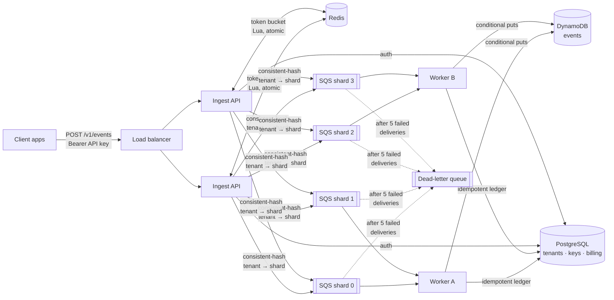

# Tally

**A multi-tenant, real-time event analytics platform.** Apps send events (`page_view`, `signup`, `purchase`); Tally ingests them at high volume, stores them durably, and serves live aggregates: counts, unique users, top pages, funnels.

Built to explore distributed-systems problems end to end: idempotent ingestion, distributed rate limiting, back-pressure, SQL + NoSQL data modelling, and probabilistic algorithms, deployed on AWS.

> **Status:** Phase 2 complete: async pipeline with exactly-once billing. See [Roadmap](#roadmap).

## Architecture



**Request path.** The API authenticates, rate-limits, and enqueues on the tenant's shard queue, then returns `202` immediately. Workers write events to DynamoDB and record usage in Postgres. They delete the message only after both succeed.

## Quickstart

```bash
make up                      # Postgres, Redis, LocalStack (SQS + DynamoDB), API on :8000, 2 workers
make tenant NAME=Acme        # prints an API key (shown once)
make demo KEY=tk_live_...    # sends sample events, handles 429s
make logs                    # watch workers pick up and bill each batch
curl localhost:8000/readyz   # {"postgres":"ok","redis":"ok","sqs":"ok"}
```

Interactive API docs are at http://localhost:8000/docs.

### Sending events

```bash
curl -X POST localhost:8000/v1/events \
  -H "Authorization: Bearer $KEY" -H "Content-Type: application/json" \
  -d '{"events":[{"event_id":"7b0c...uuid","name":"signup","distinct_id":"user_42",
                  "properties":{"plan":"pro"},"occurred_at":"2026-09-28T10:00:00Z"}]}'
# 202 {"accepted":1,"duplicates":null}   (queued; dedupe happens in the worker)
```

| Status | Meaning |
|---|---|
| `202` | Durably queued. (In `TALLY_SINK=postgres` mode, stored synchronously and `duplicates` is reported.) |
| `401` | Missing, invalid, or revoked key. |
| `413` | Batch larger than `max_batch_size` or larger than your burst limit. Split it. |
| `422` | Validation error. |
| `429` | Rate limited. Honour `Retry-After`, then resend the **same** batch. |
| `503` | Queue unavailable. Resend the same batch; it's deduplicated downstream. |

## Design decisions

**Exactly-once billing on an at-least-once queue** ([ADR 2](docs/decisions/0002-exactly-once-billing-over-at-least-once-delivery.md)). SQS can redeliver, and workers can crash mid-message. Each message carries a stable `batch_id`. Event writes are conditional puts (`attribute_not_exists(pk) OR batch_id = :this_batch`), so a redelivery re-claims its own events while a client's retry in a new batch is rejected as a duplicate. Billing goes through a ledger keyed on `batch_id`. A test kills the worker between the DynamoDB write and the billing write, and checks that the bill still comes out exact.

**Tenant affinity with consistent hashing** ([ADR 3](docs/decisions/0003-tenant-affinity-via-consistent-hashing.md)). Events go to one of N shard queues via a hash ring with virtual nodes, so each tenant always reaches the same worker (needed for Phase 3's in-memory sketches). Adding a shard moves ~1/N of tenants, not ~all of them; tests verify both the movement and the load balance.

**DynamoDB key design.** `pk = tenant#day#shard`, `sk = occurred_at#event_id`. The shard suffix (from `hash(event_id)`) spreads a big tenant's day across 8 partitions instead of one hot one. Reads scatter to all shards in parallel and k-way merge the sorted results.

**Dead-letter queue.** After 5 failed deliveries SQS moves a message to the DLQ, so one poison message can't stall a shard. A test sends a malformed message ahead of a valid one and checks the valid one still gets billed.

**Graceful shutdown.** Workers stop polling on SIGTERM (ECS deploys and scale-in), finish in-flight messages, then exit.

**Idempotency via client-generated IDs.** Every event carries an `event_id` (UUID). `(tenant_id, event_id)` is the primary key, and inserts use `ON CONFLICT DO NOTHING`, so network retries can never double-count. The whole batch, dedupe included, is one set-based `INSERT ... SELECT FROM unnest(...)` round trip.

**Billing in the same statement.** A second data-modifying CTE upserts `usage_daily` using the count of rows *actually inserted*, so duplicates are never billed and usage cannot drift from stored events. It uses the server's day, so clients cannot shift usage by backdating `occurred_at`.

**Distributed rate limiting.** A token bucket per tenant lives in Redis and is updated by a Lua script. Scripts run atomically, so N API nodes cannot jointly over-admit. `test_atomic_under_concurrency` fires 200 simultaneous requests at a burst of 20 and asserts that exactly 20 pass. The script reads `redis.call('TIME')` so all nodes share one clock. Cost equals the batch size, so batching does not bypass limits.

**API keys.** Only a SHA-256 hash is stored. SHA-256 rather than bcrypt is deliberate: keys are 192-bit random strings, not guessable passwords, and auth sits on the hot path. Lookups are cached in-process for 30 s, including misses, which trades up to 30 s of revocation lag for removing a DB round trip per request.

**Why Postgres *and* DynamoDB.** Tenants, users, keys, and billing are relational: foreign keys, constraints, and joins. Raw events are append-heavy, keyed access at a volume where DynamoDB's horizontal scaling and on-demand pricing fit better. See [`docs/decisions`](docs/decisions).

**Liveness vs readiness.** `/healthz` never touches dependencies, so a DB blip does not get containers killed. `/readyz` checks Postgres and Redis, so the load balancer stops routing to a node that cannot serve.

## Testing

Tests run against **real Postgres and Redis** (locally and as CI service containers) and **moto**, an in-process emulator of the real SQS and DynamoDB APIs. Mocking the database layer would hide exactly the behaviours that matter here: constraint semantics, `ON CONFLICT`, Lua atomicity, conditional writes, and redrive.

```bash
make up testdb && make test     # 35 tests
```

The pipeline tests cover: shard routing, end-to-end storage and billing, redelivery, a crash between the DynamoDB write and billing, client retries across batches, duplicates within a batch, poison messages reaching the DLQ without blocking the shard, splitting a large request across messages, and time-ordered scatter-gather reads.

## Roadmap

- [x] **Phase 1: Ingest + relational core.** Schema, API-key auth, distributed rate limiter, idempotent writes, billing usage, Docker, CI.
- [x] **Phase 2: Async pipeline.** Sharded SQS with consistent-hash routing, DLQ + redrive, DynamoDB event store with write sharding, exactly-once billing, graceful worker shutdown.
- [ ] **Phase 3: Algorithms.** HyperLogLog (unique users), Count-Min Sketch + heap (top-K), accuracy benchmarks vs exact counts. Extracted as a standalone open-source package.
- [ ] **Phase 4: AWS.** Terraform (VPC, ECS Fargate, RDS, ElastiCache, SQS, DynamoDB), CloudWatch dashboards and alarms.
- [ ] **Phase 5: Proof.** k6 load tests with published numbers, failure injection (kill workers mid-batch, show zero loss), dashboard UI.

## Repo layout

```
db/migrations/        SQL migrations (applied in order)
services/backend/     One codebase, two entrypoints: API (uvicorn app.main:app) and worker (python -m app.worker)
scripts/              Demo / load helpers
docs/decisions/       Architecture decision records
docs/DEVELOPMENT.md   Workflow, conventions, AI-assisted development log
```
