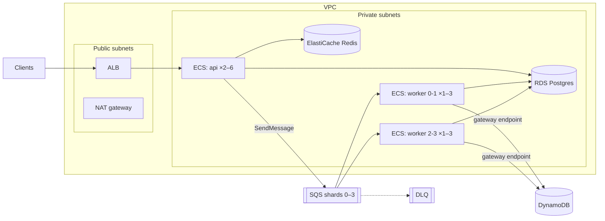

# Tally on AWS

Terraform for the full production topology. All resources are created in one
root module, split by concern:

| File | What |
|---|---|
| `network.tf` | VPC across 2 AZs, public subnets (ALB, NAT) and private subnets (everything else), free gateway endpoints for DynamoDB and S3, VPC flow logs, and tier-to-tier security groups |
| `data.tf` | RDS Postgres 16 (password managed by RDS in Secrets Manager, TLS forced), ElastiCache Redis (TLS), SQS shard queues plus DLQ with redrive, DynamoDB (on-demand, PITR), ECR (immutable tags, scan on push) |
| `iam.tf` | Least-privilege task roles: the API can only enqueue; **each worker group can only consume its own shards** |
| `ecs.tf` | Fargate cluster, API and worker services, migration init container, ALB with optional HTTPS, deployment circuit breaker with automatic rollback |
| `autoscaling.tf` | API on CPU and requests per task; workers on **age of the oldest message**, i.e. on staleness users actually feel |
| `monitoring.tf` | Alarms (DLQ, stale shards, 5xx rate, p99 latency, no healthy hosts, commit failures, RDS) → SNS email, plus a 10-widget dashboard |



## Deploy

Prerequisites: AWS credentials, Terraform ≥ 1.6, Docker.

```bash
cd infra/terraform
cp terraform.tfvars.example terraform.tfvars      # set alarm_email
terraform init
terraform apply                                   # bootstrap: creates everything, runs 0 tasks

# Build and push the image (from the repo root)
REPO=$(terraform -chdir=infra/terraform output -raw ecr_repository_url)
TAG=$(git rev-parse --short HEAD)
aws ecr get-login-password | docker login --username AWS --password-stdin ${REPO%/*}
docker build -f services/backend/Dockerfile -t $REPO:$TAG . && docker push $REPO:$TAG

terraform -chdir=infra/terraform apply -var image_tag=$TAG   # services start; migrations run first
curl $(terraform -chdir=infra/terraform output -raw api_url)/readyz
```

> **Always pass `-var image_tag=…` after the first deploy.** Omitting it puts the stack back into bootstrap mode (0 tasks). The Deploy workflow and the PR plan job both handle this for you.

After that, the **Deploy** GitHub Actions workflow does the build, push and apply on demand. It needs three repository variables: `AWS_ROLE_ARN` (an IAM role trusted by GitHub OIDC, so no stored keys), `TF_STATE_BUCKET` (versioned S3 bucket; see `backend.tf.example`), and optionally `AWS_REGION`.

**Creating a tenant** runs the CLI as a one-off task in the private subnets:

```bash
cd infra/terraform
aws ecs run-task --cluster $(terraform output -raw ecs_cluster) --launch-type FARGATE \
  --task-definition $(terraform output -raw api_task_definition) \
  --network-configuration "awsvpcConfiguration={subnets=[$(terraform output -json private_subnet_ids | jq -r 'join(",")')],securityGroups=[$(terraform output -raw api_security_group_id)]}" \
  --overrides '{"containerOverrides":[{"name":"api","command":["python","-m","app.cli","create-tenant","--name","Acme"]}]}'
# The API key is printed in the task's log group: /tally/demo/api
```

**Tear down** with `terraform destroy`. With `deletion_protection = false` (the demo default), nothing is left behind.

## Cost

Rough on-demand prices for the default demo settings in eu-west-2. Check the [AWS Pricing Calculator](https://calculator.aws/) before relying on them.

| Resource | Approx. hourly |
|---|---|
| NAT gateway (1) | $0.05 + data |
| ALB | $0.03 + LCUs |
| RDS db.t4g.micro | $0.02 |
| ElastiCache cache.t4g.micro | $0.02 |
| Fargate: 4 tasks × 0.5 vCPU / 1 GB | $0.10 |
| SQS, DynamoDB on-demand, CloudWatch | pennies at demo volume |
| **Total** | **≈ $0.20/hour, ≈ $5/day** |

Deploy, run the load test, capture the dashboard, and `terraform destroy` the same day: a few dollars in total. The NAT gateway is the biggest fixed cost. The DynamoDB and S3 gateway endpoints already keep the heaviest traffic off it.

## Deploying changes safely

* **Immutable image tags.** Every deploy is a git SHA. Rolling back means applying the previous SHA.
* **Migrations run as an init container** in every task, from the same image, before the app starts ([ADR 0005](../docs/decisions/0005-migrations-as-init-container.md)). A Postgres advisory lock makes concurrent task starts safe.
* **Circuit breaker.** If new tasks fail health checks (`/readyz` checks Postgres, Redis and SQS), ECS rolls back to the previous task definition automatically.
* **Workers drain on SIGTERM** (`stopTimeout = 45s`, longer than one 20 s long poll), so deploys and scale-in never abandon a message mid-commit. Even if they did, the message would simply be redelivered (ADR 2).

## Validation

CI runs on every change under `infra/` (see `.github/workflows/infra.yml`):

| Tool | Checks |
|---|---|
| `terraform fmt`, `terraform validate` | Formatting, syntax, and types against the real AWS provider schema |
| `tflint` + AWS ruleset | Invalid instance types, unused declarations, deprecated syntax |
| `checkov` | ~240 security policies. **217 passed, 0 failed, 21 consciously skipped** (below) |
| `terraform plan` | Against the real account, when the repo has an AWS OIDC role configured |

## Security

Defaults that are on: private subnets for all compute and data, security groups that only admit the tier in front, least-privilege IAM (per worker group), encryption at rest everywhere, TLS to RDS (forced) and Redis, the RDS password never in state or code, IMMUTABLE and scanned images, read-only root filesystems in containers, and non-root users.

Deliberate demo trade-offs. Each is a `#checkov:skip` with its reason next to the resource:

| Skipped | Why | Production fix |
|---|---|---|
| Customer-managed KMS keys (logs, DynamoDB, Redis) | AWS-managed encryption is on; CMKs add cost and key admin | Add a KMS key per data class |
| Log retention < 1 year | Cost | `log_retention_days = 365` |
| RDS/ALB deletion protection, RDS Multi-AZ | So demo stacks can be destroyed; Multi-AZ doubles cost | `deletion_protection = true`, `db_multi_az = true` |
| HTTP listener | No domain in a demo | Set `acm_certificate_arn`; HTTP then redirects |
| WAF, ALB access logs | Cost; per-tenant rate limiting is enforced in-app | Add WAF managed rules plus an S3 log bucket |
| Redis failover and AUTH | Rate-limiter state is disposable; network access is SG-restricted and TLS-encrypted | Replica plus AUTH token from Secrets Manager |
| RDS enhanced monitoring / Performance Insights | Cost at micro size | Enable when sizing up |
