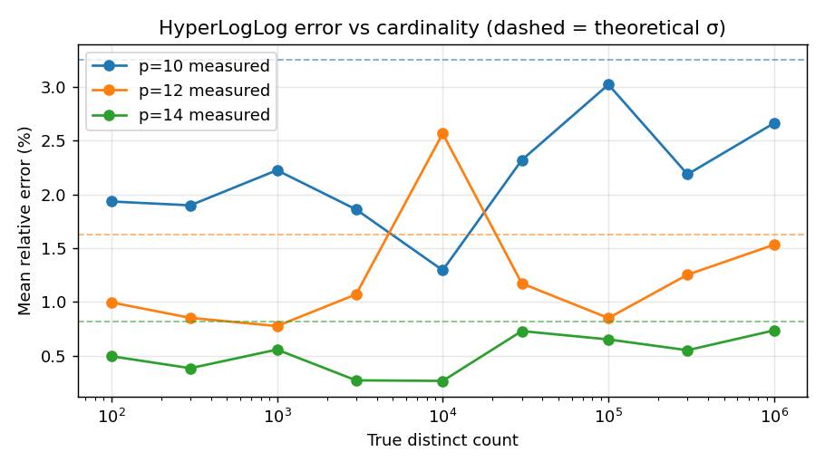
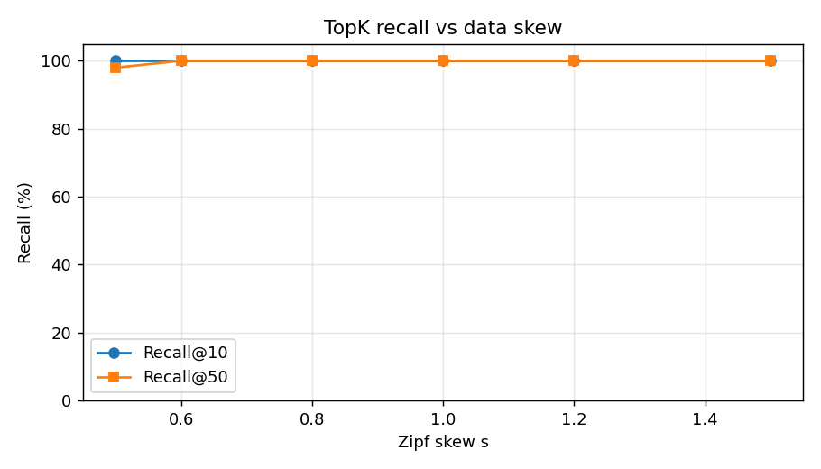

# tally-sketches: accuracy benchmarks

Generated by `benchmarks/accuracy.py`. Every number is compared against an exact baseline.

## HyperLogLog: unique counts

20 independent streams per precision. σ is the standard deviation of the signed relative error; the theory says it should be close to 1.04/√m.

| p | Memory | Theoretical σ | Measured σ @ 1M | Bias @ 1M | Mean abs error @ 1M |
|---|---|---|---|---|---|
| 10 | 1,024 B | 3.25% | 3.25% | +0.09% | 2.66% |
| 12 | 4,096 B | 1.62% | 1.81% | -0.32% | 1.53% |
| 14 | 16,384 B | 0.81% | 0.91% | -0.09% | 0.73% |

For comparison, an exact Python `set` of 1M short strings uses **85 MB**, about **5,215×** the 16 KiB of a p=14 sketch, and it keeps growing.

The chart plots *mean absolute* error, which for a normal distribution is ≈ 0.8σ, so healthy curves sit a little below their dashed σ lines.

**Known limitation.** Around n ≈ 2.5·m, where the estimator hands over from linear counting to the raw HLL estimate, there is a small positive bias (≈ +1.7% measured at p=10 over 200 trials; the bump is visible in the chart). This is inherent to the original algorithm. HyperLogLog++ (Heule et al., 2013) removes it with an empirical bias-correction table, which is planned for a future release.

## Count-Min Sketch: frequencies

200,000 events over 21,811 distinct items (Zipf s=1.1), δ=0.01. Error = estimate − true (never negative: verified for every item).

| ε | Conservative | Memory | Mean over-count | Max over-count | Bound ε·N | Items within bound |
|---|---|---|---|---|---|---|
| 0.01 | no | 11 KiB | 223.86 | 4,919 | 2,000 | 99.98% |
| 0.01 | yes | 11 KiB | 126.30 | 4,695 | 2,000 | 99.98% |
| 0.005 | no | 21 KiB | 91.93 | 4,792 | 1,000 | 99.96% |
| 0.005 | yes | 21 KiB | 51.46 | 4,695 | 1,000 | 99.96% |
| 0.001 | no | 106 KiB | 9.70 | 153 | 200 | 100.00% |
| 0.001 | yes | 106 KiB | 4.71 | 145 | 200 | 100.00% |
| 0.0005 | no | 212 KiB | 3.14 | 24 | 100 | 100.00% |
| 0.0005 | yes | 212 KiB | 1.30 | 13 | 100 | 100.00% |

The guarantee requires ≥ 99% of items within ε·N. Conservative update cuts the mean over-count substantially at identical memory.

## TopK: heavy hitters

200,000 events over 50,000 distinct items at varying skew. Recall = share of the true top-k found. Default ε=0.001, δ=0.01.

| Zipf skew s | Recall@10 | Recall@50 | Top 10 in exact order |
|---|---|---|---|
| 0.5 | 100% | 98% | yes |
| 0.6 | 100% | 100% | yes |
| 0.8 | 100% | 100% | yes |
| 1.0 | 100% | 100% | yes |
| 1.2 | 100% | 100% | yes |
| 1.5 | 100% | 100% | yes |

Lower skew means a flatter distribution where the 'top' items are barely more frequent than the rest. Their true counts sit within the sketch's error of each other, so ranking gets harder for every heavy-hitters algorithm. Real web traffic is typically s ≈ 1 or higher.

## Throughput (pure Python, single core)

| Structure | Adds / second |
|---|---|
| HyperLogLog(p=14) | 1,135,942 |
| CountMinSketch(ε=0.001) | 331,136 |
| TopK(k=20) | 309,918 |

Fast enough for per-worker aggregation in Tally. A C extension would be the next step if a single core ever became the bottleneck.
